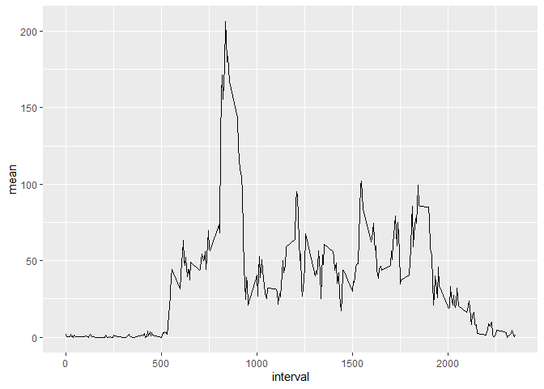
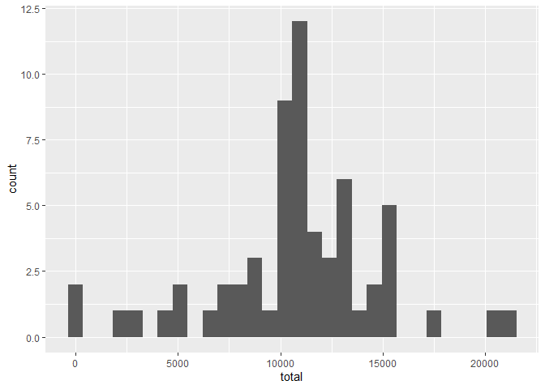

## Loading and preprocessing the data
Start by loading the required packages and reading in the data.

```r
library(ggplot2)
library(dplyr)
```

```
## 
## Attaching package: 'dplyr'
```

```
## The following objects are masked from 'package:stats':
## 
##     filter, lag
```

```
## The following objects are masked from 'package:base':
## 
##     intersect, setdiff, setequal, union
```

```r
activity <- read.csv("activity.csv")
activity$date <- as.Date(activity$date, format = "%Y-%m-%d") #converting the date column from character to date class
```

## What is mean total number of steps taken per day?
This table shows the total number of steps per day

```r
activity_total <- activity %>% group_by(date) %>% summarize(total = sum(steps))
```

```
## `summarise()` ungrouping output (override with `.groups` argument)
```

```r
print(activity_total)
```

```
## # A tibble: 61 x 2
##    date       total
##    <date>     <int>
##  1 2012-10-01    NA
##  2 2012-10-02   126
##  3 2012-10-03 11352
##  4 2012-10-04 12116
##  5 2012-10-05 13294
##  6 2012-10-06 15420
##  7 2012-10-07 11015
##  8 2012-10-08    NA
##  9 2012-10-09 12811
## 10 2012-10-10  9900
## # ... with 51 more rows
```

This histogram shows the distribution of total number of steps taken per day

```r
ggplot(activity_total, aes(total)) + geom_histogram()
```

```
## `stat_bin()` using `bins = 30`. Pick better value with `binwidth`.
```

```
## Warning: Removed 8 rows containing non-finite values (stat_bin).
```

<!-- -->

This table shows the mean and median total number of steps taken per day

```r
activity_mm <- activity_total %>% summarize(mean = mean(total, na.rm = TRUE), median = median(total, na.rm = TRUE))
print(activity_mm)
```

```
## # A tibble: 1 x 2
##     mean median
##    <dbl>  <int>
## 1 10766.  10765
```

## What is the average daily activity pattern?
This plot shows the average number of steps taken per 5-minute interval

```r
activity_interval <- activity %>% group_by(interval) %>% summarize(mean = mean(steps, na.rm = TRUE))
```

```
## `summarise()` ungrouping output (override with `.groups` argument)
```

```r
ggplot(activity_interval, aes(interval, mean)) + geom_line()
```

<!-- -->

This is the 5-minute interval with the highest average steps taken

```r
activity_interval[which.max(activity_interval$mean),]
```

```
## # A tibble: 1 x 2
##   interval  mean
##      <int> <dbl>
## 1      835  206.
```

## Imputing missing values
This is the number of rows with missing values

```r
sum(is.na(activity$steps))
```

```
## [1] 2304
```

This is the new data frame with the missing values replaced by mean values of the specific 5-minute interval

```r
activity_complete <- activity %>% group_by(interval) %>% mutate(steps = ifelse(is.na(steps), mean(steps, na.rm = TRUE), steps)) %>% ungroup()
```

This is a histogram of the distribution of total steps per day with the imputed values

```r
activity_complete_total <- activity_complete %>% group_by(date) %>% summarize(total = sum(steps))
```

```
## `summarise()` ungrouping output (override with `.groups` argument)
```

```r
ggplot(activity_complete_total, aes(total)) + geom_histogram()
```

```
## `stat_bin()` using `bins = 30`. Pick better value with `binwidth`.
```

<!-- -->

This table shows the mean and median total number of steps taken per day with the imputedvalues

```r
activity_complete_mm <- activity_complete_total %>% summarize(mean = mean(total), median = median(total))
print(activity_complete_mm)
```

```
## # A tibble: 1 x 2
##     mean median
##    <dbl>  <dbl>
## 1 10766. 10766.
```

If you compare these values to the values generated from the incomplete data set you'll see that the mean remained the same while the median only changed by 1, increasing from 10765 to 10766. For this data set there was a relatively small impact from the imputations done. 

## Are there differences in activity patterns between weekdays and weekends?

This is a time series plot showing the average number of steps taken for each 5-minute interval grouped by weekends and weekdays

```r
activity_complete$type <- weekdays(activity$date)
activity_complete <- activity_complete %>% mutate(type = ifelse(type %in% c("Monday", "Tuesday", "Wednesday", "Thursday", "Friday"), "Weekday", "Weekend"))
activity_complete$type <- factor(activity_complete$type, levels = c("Weekday", "Weekend"))
activity_complete_interval <- activity_complete %>% group_by(type, interval) %>% summarize(mean = mean(steps))
```

```
## `summarise()` regrouping output by 'type' (override with `.groups` argument)
```

```r
ggplot(activity_complete_interval, aes(interval, mean)) + geom_line() + facet_wrap(~type)
```

<!-- -->
